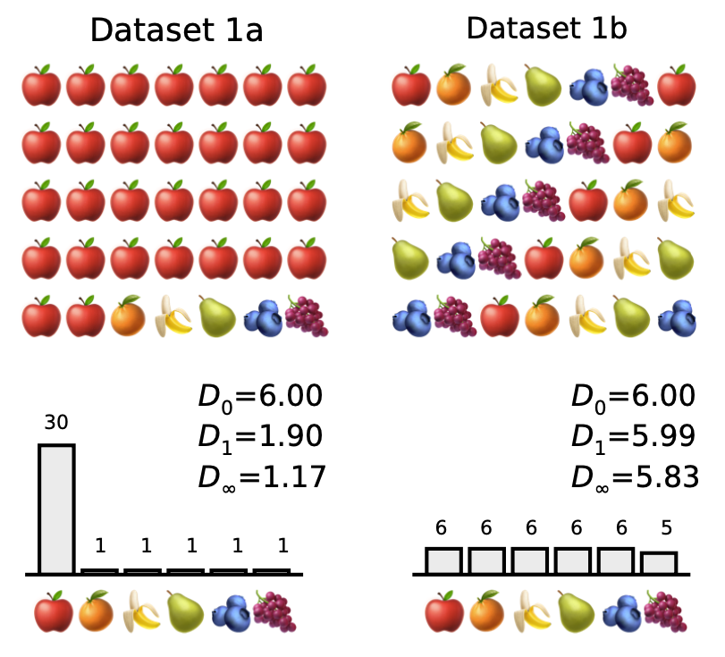

# <h1> <i>greylock</i>: A Python package for measuring the composition of complex datasets</h1>

[](https://www.python.org/downloads/release/python-380/)
[](https://github.com/ArnaoutLab/diversity/actions/workflows/tests.yml)

- [About](#about)
  - [Definitions](#definitions)
  - [Partitioned diversity](#partitioned-diversity)
  - [Frequency-sensitive diversity](#frequency-sensitive-diversity)
  - [Similarity-sensitive diversity](#similarity-sensitive-diversity)
  - [Rescaled diversity indices](#rescaled-diversity-indices)
  - [One package to rule them all](#one-package-to-rule-them-all)
- [Basic usage](#basic-usage)
  - [alpha diversities](#alpha-diversities)
  - [beta diversities](#beta-diversities)
- [Advanced usage](#advanced-usage)
- [Command-line usage](#command-line-usage)
- [Applications](#applications)
- [Alternatives](#alternatives)

# About

`greylock` calculates effective numbers in an extended version of the Hill framework, with extensions due to Leinster and Cobbold and Reeve et al. “Extending” a hill makes a mountain. At 3,489 feet (1,063 meters), Mount Greylock is Massachusetts’ tallest mountain. It is named for Gray Lock (c. 1670–1750),  a historical figure of the Abnaki, an indigenous people of New England.

## Availability and installation
The package is available on GitHub at https://github.com/ArnaoutLab/diversity. It can be installed by running

`pip install greylock`

from the command-line interface. The test suite runs successfully on Macintosh, Windows, and Unix systems. The unit tests (including a coverage report) can be run after installation by

`pytest --pyargs greylock --cov greylock`

## How to cite this work

If you use this package, please cite it as:

Nguyen et al., <i>greylock</i>. <https://github.com/ArnaoutLab/diversity>

## Definitions

A ***community*** is a collection of elements called ***individuals***, each of which is assigned a label called its ***species***, where multiple individuals may have the same species. An example of a community is all the animals and plants living in a lake. A ***metacommunity*** consists of several communities. An example of a metacommunity is all the animals in a lake split into different depths. Each community that makes up a metacommunity is called a ***subcommunity***.

Even though the terms metacommunity and subcommunity originate in ecology, we use them in a broader sense. If one is interested in analyzing a subset of a dataset, then the subset is a subcommunity and the entire dataset is the metacommunity. Alternatively, if one is interested in how individual datasets (e.g. from individual research subjects) compare to all datasets used in a study, the individual datasets are subcommunities and the set of all datasets is the metacommunity. (When there is only a single dataset under study, we use “subcommunity” and “metacommunity” interchangeably as convenient.)

A ***diversity index*** is a statistic associated with a community, which describes how much the species of its individuals vary. For example, a community of many individuals of the same species has a very low diversity whereas a community with multiple species and the same amount of individuals per species has a high diversity.

## Partitioned diversity

Some diversity indices compare the diversities of the subcommunities with respect to the overall metacommunity. For example, two subcommunities with the same frequency distribution but no shared species each comprise half of the combined metacommunity diversity.

## Frequency-sensitive diversity

[In 1973, Hill introduced a framework](https://doi.org/10.2307/1934352) which unifies commonly used diversity indices into a single parameterized family of diversity measures. The so-called ***viewpoint parameter*** can be thought of as the sensitivity to rare species. At one end of the spectrum, when the viewpoint parameter is set to 0, species frequency is ignored entirely, and only the number of distinct species matters, while at the other end of the spectrum, when the viewpoint parameter is set to $\infty$, only the highest frequency species in a community is considered by the corresponding diversity measure. Common diversity measures such as ***species richness***, ***Shannon entropy***, the ***Gini-Simpson index***, and the ***Berger-Parker index*** have simple and natural relationships with Hill's indices at different values for the viewpoint parameter ($0$, $1$, $2$, $\infty$, respectively).

## Similarity-sensitive diversity

In addition to being sensitive to frequency, it often makes sense to account for similarity in a diversity measure. For example, a community of two different types of rodents may be considered less diverse than a community where one of the rodent species was replaced by the same number of individuals of a bird species. [Reeve et al.](https://arxiv.org/abs/1404.6520) and [Leinster and Cobbold](https://doi.org/10.1890/10-2402.1) present a general mathematically rigorous way of incorporating similarity measures into Hill's framework. The result is a family of similarity-sensitive diversity indices parameterized by the same viewpoint parameter as well as the similarity function used for the species in the meta- or subcommunities of interest. These similarity-sensitive diversity measures account for both the pairwise similarity between all species and their frequencies.

## Rescaled diversity indices

In addition to the diversity measures introduced by Reeve et al, we also included two new rescaled measures $\hat{\rho}$ and $\hat{\beta}$, as well as their metacommunity counterparts. The motivation for introducing these measures is that $\rho$ can become very large if the number of subcommunities is large. Similarly, $\beta$ can become very small in this case. The rescaled versions are designed so that they remain of order unity even when there are lots of subcommunities.

## One package to rule them all

The `greylock` package is able to calculate all of the similarity- and frequency-sensitive subcommunity and metacommunity diversity measures described in [Reeve et al.](https://arxiv.org/abs/1404.6520). See the paper for more in-depth information on their derivation and interpretation.


**Supported subcommunity diversity measures**:

  - $\alpha$ - diversity of subcommunity $j$ in isolation, per individual
  - $\bar{\alpha}$ - diversity of subcommunity $j$ in isolation
  - $\rho$ - redundancy of subcommunity $j$
  - $\bar{\rho}$ - representativeness of subcommunity $j$
  - $\hat{\rho}$ - rescaled version of redundancy ($\rho$)
  - $\beta$ - distinctiveness of subcommunity $j$
  - $\bar{\beta}$ - effective number of distinct subcommunities
  - $\hat{\beta}$ - rescaled version of distinctiveness ($\beta$) 
  - $\gamma$ - contribution of subcommunity $j$ toward metacommunity diversity


**Supported metacommunity diversity measures**:
  - $A$ - naive-community metacommunity diversity
  - $\bar{A}$ - average diversity of subcommunities
  - $R$ - average redundancy of subcommunities
  - $\bar{R}$ - average representativeness of subcommunities
  - $\hat{R}$ - average rescaled redundancy of subcommunities
  - $B$ - average distinctiveness of subcommunities
  - $\bar{B}$ - effective number of distinct subcommunities
  - $\hat{B}$ - average rescaled distinctiveness of subcommunities
  - $G$ - metacommunity diversity


# Basic usage
## Alpha diversities 

We illustrate the basic usage of `greylock` on simple, field-of-study-agnostic datasets of fruits and animals. First, consider two datasets of size $n=35$ that each contains counts of six types of fruit: apples, oranges, bananas, pears, blueberries, and grapes.



Dataset 1a is mostly apples; in dataset 1b, all fruits are represented at almost identical frequencies. The frequencies of the fruits in each dataset is tabulated below:

|           | Dataset 1a | Dataset 1b | 
| :-------- | ---------: | ---------: | 
| apple     |         30 |          6 | 
| orange    |          1 |          6 |
| banana    |          1 |          6 |
| pear      |          1 |          6 |
| blueberry |          1 |          6 |
| grape     |          1 |          5 |
| total     |         35 |         35 | 

A frequency-sensitive metacommunity can be created in Python by passing a `counts` DataFrame to a `Metacommunity` object:

```python
import pandas as pd
import numpy as np
from greylock import Metacommunity

counts_1a = pd.DataFrame({"Dataset 1a": [30, 1, 1, 1, 1, 1]}, 
   index=["apple", "orange", "banana", "pear", "blueberry", "grape"])

metacommunity_1a = Metacommunity(counts_1a)
```

Once a metacommunity has been created, diversity measures can be calculated. For example, to calculate $D_1$, we type:

```python
metacommunity_1a.subcommunity_diversity(viewpoint=1, measure='alpha')
```

The output shows that $D_1=1.90$. To calculate the corresponding metacommunity diversity index:

```python
metacommunity_1a.metacommunity_diversity(viewpoint=1, measure='alpha')
```

In this example, the metacommunity indices are the same as the subcommunity ones, since there is only one subcommunity. To calculated multiple diversity measures at once and store them in a DataFrame, we type:

```python 
metacommunity_1a.to_dataframe(viewpoint=[0, 1, np.inf])
```

which produces the following output:

|      | community     | viewpoint | alpha |  rho | beta | gamma | normalized_alpha | normalized_rho | normalized_beta | rho_hat | beta_hat |
| ---: | :------------ | --------: | ----: | ---: | ---: | ----: | ---------------: | -------------: | --------------: | ------: | -------: |
|    0 | metacommunity |      0.00 |  6.00 | 1.00 | 1.00 |  6.00 |             6.00 |           1.00 |            1.00 |    1.00 |     1.00 |
|    1 | Dataset 1a    |      0.00 |  6.00 | 1.00 | 1.00 |  6.00 |             6.00 |           1.00 |            1.00 |    1.00 |     1.00 |
|    2 | metacommunity |      1.00 |  1.90 | 1.00 | 1.00 |  1.90 |             1.90 |           1.00 |            1.00 |    1.00 |     1.00 |
|    3 | Dataset 1a    |      1.00 |  1.90 | 1.00 | 1.00 |  1.90 |             1.90 |           1.00 |            1.00 |    1.00 |     1.00 |
|    4 | metacommunity |       inf |  1.17 | 1.00 | 1.00 |  1.17 |             1.17 |           1.00 |            1.00 |    1.00 |     1.00 |
|    5 | Dataset 1a    |       inf |  1.17 | 1.00 | 1.00 |  1.17 |             1.17 |           1.00 |            1.00 |    1.00 |     1.00 |


Next, let us repeat for Dataset 1b. Again, we make the `counts` dataframe and a `Metacommunity` object:

```python
counts_1b = pd.DataFrame({"Community 1b": [6, 6, 6, 6, 6, 5]},
    index=["apple", "orange", "banana", "pear", "blueberry", "grape"])

metacommunity_1b = Metacommunity(counts_1b)
```

To obtain $D_1$, we run:

```python
metacommunity_1b.subcommunity_diversity(viewpoint=1, measure='alpha')
```

We find that $D_1 \approx 5.99$ for Dataset 1b. The larger value of $D_1$ for Dataset 1b aligns with the intuitive sense that more balance in the frequencies of unique elements means a more diverse dataset. To output multiple diversity measures at once, we run:

```python
metacommunity_1b.to_dataframe(viewpoint=[0, 1, np.inf])
```

which produces the output:

|      | community     | viewpoint | alpha |  rho | beta | gamma | normalized_alpha | normalized_rho | normalized_beta | rho_hat | beta_hat |
| ---: | :------------ | --------: | ----: | ---: | ---: | ----: | ---------------: | -------------: | --------------: | ------: | -------: |
|    0 | metacommunity |      0.00 |  6.00 | 1.00 | 1.00 |  6.00 |             6.00 |           1.00 |            1.00 |    1.00 |     1.00 |
|    1 | Dataset 1b    |      0.00 |  6.00 | 1.00 | 1.00 |  6.00 |             6.00 |           1.00 |            1.00 |    1.00 |     1.00 |
|    2 | metacommunity |      1.00 |  5.99 | 1.00 | 1.00 |  5.99 |             5.99 |           1.00 |            1.00 |    1.00 |     1.00 |
|    3 | Dataset 1b    |      1.00 |  5.99 | 1.00 | 1.00 |  5.99 |             5.99 |           1.00 |            1.00 |    1.00 |     1.00 |
|    4 | metacommunity |       inf |  5.83 | 1.00 | 1.00 |  5.83 |             5.83 |           1.00 |            1.00 |    1.00 |     1.00 |
|    5 | Dataset 1b    |       inf |  5.83 | 1.00 | 1.00 |  5.83 |             5.83 |           1.00 |            1.00 |    1.00 |     1.00 |

The `greylock` package can also calculate similarity-sensitive diversity measures for any user-supplied definition of similarity. To illustrate, we now consider a second example in which the dataset elements are all unique. Uniqueness means element frequencies are identical, so similarity is the only factor that influences diversity calculations.


The datasets now each contain a set of animals in which each animal appears only once. We consider phylogenetic similarity (approximated roughly, for purposes of this example). Dataset 2a consists entirely of birds, so all entries in the similarity matrix are close to $1$:

```python
labels_2a = ["owl", "eagle", "flamingo", "swan", "duck", "chicken", "turkey", "dodo", "dove"]
no_species_2a = len(labels_2a)
S_2a = np.identity(n=no_species_2a)


S_2a[0][1:9] = (0.91, 0.88, 0.88, 0.88, 0.88, 0.88, 0.88, 0.88) # owl
S_2a[1][2:9] = (      0.88, 0.89, 0.88, 0.88, 0.88, 0.89, 0.88) # eagle
S_2a[2][3:9] = (            0.90, 0.89, 0.88, 0.88, 0.88, 0.89) # flamingo
S_2a[3][4:9] = (                  0.92, 0.90, 0.89, 0.88, 0.88) # swan
S_2a[4][5:9] = (                        0.91, 0.89, 0.88, 0.88) # duck
S_2a[5][6:9] = (                              0.92, 0.88, 0.88) # chicken
S_2a[6][7:9] = (                                    0.89, 0.88) # turkey
S_2a[7][8:9] = (                                          0.88) # dodo
                                                                # dove


S_2a = np.maximum( S_2a, S_2a.transpose() )
```
We may optionally convert this to a DataFrame:
```python
S_2a = pd.DataFrame({labels_2a[i]: S_2a[i] for i in range(no_species_2a)}, index=labels_2a)
```

which corresponds to the following table:

|           |      owl |     eagle | flamingo |      swan |    duck |   chicken |    turkey |     dodo |       dove |
| :-------- | -------: | --------: | -------: | --------: | ------: | --------: | --------: | -------: | ---------: |
|       owl |        1 |      0.91 |     0.88 |      0.88 |    0.88 |      0.88 |      0.88 |     0.88 |       0.88 |
|     eagle |     0.91 |         1 |     0.88 |      0.89 |    0.88 |      0.88 |      0.88 |     0.89 |       0.88 |
|  flamingo |     0.88 |      0.88 |        1 |      0.90 |    0.89 |      0.88 |      0.88 |     0.88 |       0.89 |
|      swan |     0.88 |      0.89 |     0.90 |         1 |    0.92 |      0.90 |      0.89 |     0.88 |       0.88 |
|      duck |     0.88 |      0.88 |     0.89 |      0.92 |       1 |      0.91 |      0.89 |     0.88 |       0.88 |
|   chicken |     0.88 |      0.88 |     0.88 |      0.90 |    0.91 |         1 |      0.92 |     0.88 |       0.88 |
|    turkey |     0.88 |      0.88 |     0.88 |      0.89 |    0.89 |      0.92 |         1 |     0.89 |       0.88 |
|      dodo |     0.88 |      0.89 |     0.88 |      0.88 |    0.88 |      0.88 |      0.89 |        1 |       0.88 |
|      dove |     0.88 |      0.88 |     0.89 |      0.88 |    0.88 |      0.88 |      0.88 |     0.88 |          1 |


We make a DataFrame of counts in the same way as in the previous example:

```python
counts_2a = pd.DataFrame({"Community 2a": [1, 1, 1, 1, 1, 1, 1, 1, 1]}, index=labels_2a)
```

To compute the similarity-sensitive diversity indices, we now pass the similarity matrix to the similarity argument of the metacommunity object.
(Note that `S_2a` may be in the forme of either the numpy array or the DataFrame):

```python
metacommunity_2a = Metacommunity(counts_2a, similarity=S_2a)
```

We can find $D_0^Z$ similarly to the above:

```python
metacommunity_2a.subcommunity_diversity(viewpoint=0, measure='alpha')
```

The output tells us that $D_0^Z=1.11$. The fact that this number is close to 1 reflects the fact that all individuals in this community are very similar to each other (all birds).

In contrast, Dataset 2b consists of members from two different phyla: vertebrates and invertebrates. As above, we define a similarity matrix:

```python
labels_2b = ("ladybug", "bee", "butterfly", "lobster", "fish", "turtle", "parrot", "llama", "orangutan")
no_species_2b = len(labels_2b)
S_2b = np.identity(n=no_species_2b)
S_2b[0][1:9] = (0.60, 0.55, 0.45, 0.25, 0.22, 0.23, 0.18, 0.16) # ladybug
S_2b[1][2:9] = (      0.60, 0.48, 0.22, 0.23, 0.21, 0.16, 0.14) # bee
S_2b[2][3:9] = (            0.42, 0.27, 0.20, 0.22, 0.17, 0.15) # bu’fly
S_2b[3][4:9] = (                  0.28, 0.26, 0.26, 0.20, 0.18) # lobster
S_2b[4][5:9] = (                        0.75, 0.70, 0.66, 0.63) # fish
S_2b[5][6:9] = (                              0.85, 0.70, 0.70) # turtle
S_2b[6][7:9] = (                                    0.75, 0.72) # parrot
S_2b[7][8:9] = (                                          0.85) # llama
                                                                #orangutan

S_2b = np.maximum( S_2b, S_2b.transpose() )
# optional, convert to DataFrame for inspection:
S_2b = pd.DataFrame({labels_2b[i]: S_2b[i] for i in range(no_species_2b)}, index=labels_2b)
```

which corresponds to the following table:
|           |  ladybug |       bee |    b'fly |   lobster |    fish |    turtle |    parrot |    llama |  orangutan |
| :-------- | -------: | --------: | -------: | --------: | ------: | --------: | --------: | -------: | ---------: |
| ladybug   |        1 |      0.60 |     0.55 |      0.45 |    0.25 |      0.22 |      0.23 |     0.18 |       0.16 |
| bee       |     0.60 |         1 |     0.60 |      0.48 |    0.22 |      0.23 |      0.21 |     0.16 |       0.14 |
| b'fly     |     0.55 |      0.60 |        1 |      0.42 |    0.27 |      0.20 |      0.22 |     0.17 |       0.15 |
| lobster   |     0.45 |      0.48 |     0.42 |         1 |    0.28 |      0.26 |      0.26 |     0.20 |       0.18 |
| fish      |     0.25 |      0.22 |     0.27 |      0.28 |       1 |      0.75 |      0.70 |     0.66 |       0.63 |
| turtle    |     0.22 |      0.23 |     0.20 |      0.26 |    0.75 |         1 |      0.85 |     0.70 |       0.70 |
| parrot    |     0.23 |      0.21 |     0.22 |      0.26 |    0.70 |      0.85 |         1 |     0.75 |       0.72 |
| llama     |     0.18 |      0.16 |     0.17 |      0.20 |    0.66 |      0.70 |      0.75 |        1 |       0.85 |
| orangutan |     0.16 |      0.14 |      0.15|      0.18 |     0.63|      0.70 |      0.72 |     0.85 |          1 |

The values of the similarity matrix indicate high similarity among the vertebrates, high similarity among the invertebrates and low similarity between vertebrates and invertebrates.

To calculate the alpha diversity (with $q=0$ as above), we proceed as before, defining counts, creating a Metacommunity object, and calling its `subcommunity_diversity` method with the desired settings:

```python
counts_2b = pd.DataFrame({"Community 2b": [1, 1, 1, 1, 1, 1, 1, 1, 1]}, index=labels_2b)
metacommunity_2b = Metacommunity(counts_2b, similarity=S_2b)
metacommunity_2b.subcommunity_diversity(viewpoint=0, measure='alpha')
```

which outputs $D_0^Z=2.16$. That this number is close to 2 reflects the fact that members in this community belong to two broad classes of animals: vertebrates and invertebrates. The remaining $0.16$ above $2$ is interpreted as reflecting the diversity within each phylum.

## Beta diversities
Recall beta diversity is between-group diversity. To illustrate, we will re-imagine Dataset 2b as a metacommunity made up of 2 subcommunities—the invertebrates and the vertebrates—defined as follows:

```python
counts_2b_1 = pd.DataFrame(
{
   "Subcommunity_2b_1": [1, 1, 1, 1, 0, 0, 0, 0, 0], # invertebrates
      "Subcommunity_2b_2": [0, 0, 0, 0, 1, 1, 1, 1, 1], #   vertebrates
},
index=labels_2b
)
```

We can obtain the representativeness $\bar{\rho}$ (“rho-bar”) of each subcommunity, here at $q=0$, as follows:

```python
metacommunity_2b_1 = Metacommunity(counts_2b_1, similarity=S_2b)
metacommunity_2b_1.subcommunity_diversity(viewpoint=0, 
measure='rho_hat')
```

with the output $[0.41, 0.21]$. Recall $\hat{\rho}$ indicates how well a subcommunity represents the metacommunity. We find that $\hat{\rho}$ of the two subcommunities are rather low— $0.41$ and $0.21$ for the invertebrates and the vertebrates, respectively—reflecting the low similarity between these groups. 
Note the invertebrates are more diverse than the vertebrates, which we can see by calculating $q=0$ $\alpha$ diversity of these subcommunities:

```python
metacommunity_2b_1.subcommunity_diversity(viewpoint=0, measure='alpha')
```

which outputs $[3.54, 2.30]$. In contrast, suppose we split Dataset 2b into two subsets at random, without regard to phylum:

```python
counts_2b_2 = pd.DataFrame(
{
   "Subcommunity_2b_3": [1, 0, 1, 0, 1, 0, 1, 0, 1],
   "Subcommunity_2b_4": [0, 1, 0, 1, 0, 1, 0, 1, 0],
},
index=labels_2b
)
```

Proceeding again as above,

```python
metacommunity_2b_2 = Metacommunity(counts_2b_2, similarity=S_2b)
metacommunity_2b_2.subcommunity_diversity(viewpoint=0, measure='rho_hat')
```

yielding $[0.68, 1.07]$. We find that the $\hat{\rho}$ of the two subsets are now, respectively, $0.68$ and $1.07$. These high values reflect the fact that the vertebrates and the invertebrates are roughly equally represented.

# Advanced usage

In the examples above, the entire similarity matrix has been created in RAM (as a `numpy.ndarray` or `pandas.DataFrame`) before being passed to the `Metacommunity` constructor. However, this may not be the best tactic for large datasets. The `greylock` package offers better options in these cases. Given that the
simillarity matrix is of complexity $O(n^2)$ (where $n$ is the number of species), the creation, storage, and use of the similarity matrix are the most computationally resource-intense aspects of calculating diversity. Careful consideration of how to handle the similarity matrix can extend the range of problems that are tractable by many orders of magnitude.

Any large similarity matrix that is created in Python as a `numpy.ndarray` benefits from being memory-mapped, as NumPy can then use the data without requiring it all to be in memory. See the NumPy [memmap documentation](https://numpy.org/doc/stable/reference/generated/numpy.memmap.html) for guidance. Because `memmap` is a subclass of `ndarray`, using this type of file storage for the similarity matrix requires no modification to your use of the Metacommunity API. This conversion, and the resulting storage of the data on disk, has the advantage that if you revise the downstream analysis, or perform additional analyses, re-calculation of the similarity matrix may be skipped.

The strategy of calculate-once, use-many-times afforded by storage of the similarity matrix to a file allows you to do the work of calculating the similarity matrix in an entirely separate process. You may choose to calculate the similarity matrix in a more performant language, such as C++, and/or inspect the matrix in Excel. In these cases, it is  convenient to store the similarity matrix in a non-Python-specific format, such as a .csv or .tsv file. The entire csv/tsv file need not be read into memory before invoking the `Metacommunity` constructor; when this constructor is given the path of a cvs or tsv file, it will use the file's contents in a memory-efficient way, reading in chunks as they are used. 

To illustrate passing a csv file, we re-use the counts_2b_1 and S_2b from above and save the latter as .csv files (note `index=False`, since the csv files should *not* contain row labels):
```python
S_2b.to_csv("S_2b.csv", index=False)
```
then we can build a metacommunity as follows
```python
metacommunity_2b_1 = Metacommunity(counts_2b_1, similarity='S_2b.csv', chunk_size=5)
```
The optional `chunk_size` argument specifies how many rows of the similarity matrix are read from the file at a time.

Alternatively, to avoid a large footprint on either RAM or disk, the similarity matrix can be constructed and processed in chunks by passing a similarity function to `similarity` and an array or `DataFrame` of features to `X`. Each row of X represents the feature values of a species. For example, given numeric features all of the same type:

```
X = np.array([
  [1, 2], 
  [3, 4], 
  [5, 6]
])

def similarity_function(species_i, species_j):
  return 1 / (1 + np.linalg.norm(species_i - species_j))

metacommunity = Metacommunity(counts, similarity=similarity_function, X=X, symmetric=True)
```

If there are features of various types, and it would be convenient to address features by name, features can be supplied in a DataFrame. (Note that, because of the use of named tuples to represent species in the similarity function, it is helpful if the column names are valid Python identifiers.)

```
X = pd.DataFrame(
    {
        "breathes": [
            "water",
            "air",
            "air",
        ],
        "covering": [
            "scales",
            "scales",
            "fur",
        ],
        "n_legs": [
            0,
            0,
            4,
        ],
    },
    index=[
        "tuna",
        "snake",
        "rabbit",
    ],
)

def feature_similarity(animal_i, animal_j):
    if animal_i.breathes != animal_j.breathes:
        return 0.0
    if animal_i.covering == animal_j.covering:
        result = 1
    else:
        result = 0.5
    if animal_i.n_legs != animal_j.n_legs:
        result *= 0.5
    return result

metacommunity = Metacommunity(counts, similarity=feature_similarity, X=X, symmetric=True)
```

Each `chunk_size` rows of the similarity matrix are processed as a separate job, and `greylock` uses the [Ray framework](https://pypi.org/project/ray/) to parallelize these jobs. Thanks to this parallelization, up to an N-fold speedup is possible (where N is the number of CPUs).

Set the `symmetric` argument to `True` when the following (typical) conditions hold:

* The similarity matrix is symmetric (i.e. similarity[i, j] == similarity[j, i] for all i and j).
* The similarity of each species with itself is 1.0.
* The number of subcommunities is much smaller than the number of species.

If `symmetric=True` then the similarity function will only be called for pairs of rows `species[i], species[j]` where i < j, and the similarity of $species_i$ to $species_j$ will be re-used for the similarity of $species_j$ to $species_i$. Thus, a nearly 2-fold speed-up is possible, if the similarity function is computationally expensive. (For a discussion of nonsymmetric similarity, see [Leinster and Cobbold](https://doi.org/10.1890/10-2402.1).)

# Command-line usage
The `greylock` package can also be used from the command line as a module (via `python -m`). To illustrate using `greylock` this way, we re-use again the example with counts_2b_1 and S_2b, now with counts_2b_1 also saved as a csv file (note again `index=False`):
```python
counts_2b_1.to_csv("counts_2b_1.csv", index=False)
```

Then from the command line: 

`python -m greylock -i counts_2b_1.csv -s S_2b.csv -v 0 1 inf`

The output is a table with all the diversity indices for q=0, 1, and ∞. Note that while .csv or .tsv are acceptable as input, the output is always tab-delimited. The input filepath (`-i`) and the similarity matrix filepath (`-s`) can be URLs to data files hosted on the web. Also note that values of $q>100$ are all calculated as $q=\infty$.

For further options, consult the help:

`python -m greylock -h`

# Applications

For applications of the `greylock` package to various fields (immunomics, metagenomics, medical imaging and pathology), we refer to the Jupyter notebooks below:

- [Immunomics](https://github.com/ArnaoutLab/diversity_notebooks_and_data/blob/main/immunomics/immunomics_fig3.ipynb)
- [Metagenomics](https://github.com/ArnaoutLab/diversity_notebooks_and_data/blob/main/metagenomics/metagenomics_figs4-5.ipynb)
- [Medical imaging](https://github.com/ArnaoutLab/diversity_notebooks_and_data/blob/main/medical_imaging/medical_imaging_fig6-7.ipynb)
- [Pathology](https://github.com/ArnaoutLab/diversity_notebooks_and_data/blob/main/pathology/pathology_fig8.ipynb)

The examples in the Basic usage section are also made available as a notebook [here](https://github.com/ArnaoutLab/diversity_notebooks_and_data/blob/main/fruits_and_animals/fruits_and_animals_fig1_2.ipynb). For more information, please see our [preprint](https://arxiv.org/abs/2401.00102).

# Alternatives

To date, we know of no other python package that implements the partitioned frequency- and similarity-sensitive diversity measures defined by [Reeve at al.](https://arxiv.org/abs/1404.6520). However, there is a [R package](https://github.com/boydorr/rdiversity) and a [Julia package](https://github.com/EcoJulia/Diversity.jl).


