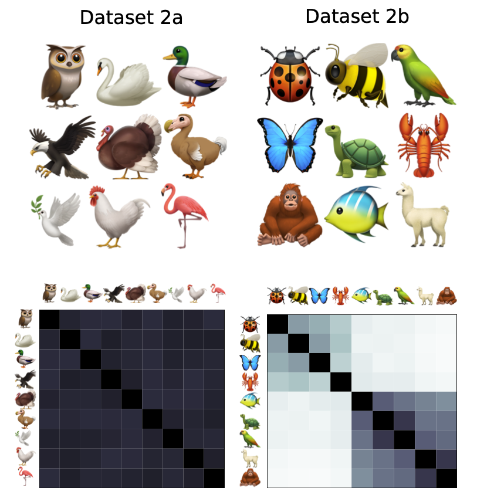

# diversity: partitioned frequency- and similarity-sensitive diversity in Python


[](https://www.python.org/downloads/release/python-380/)


- [About](#about)
  - [Definitions](#definitions)
  - [Partitioned diversity](#partitioned-diversity)
  - [Frequency-sensitive diversity](#frequency-sensitive-diversity)
  - [Similarity-sensitive diversity](#similarity-sensitive-diversity)
  - [Rescaled diversity indices](#rescaled-diversity-indices)
  - [One package to rule them all](#one-package-to-rule-them-all)
- [Basic usage](#basic-usage)
  - [alpha diversities](#alpha-diversities)
  - [beta diversities](#beta-diversities)
- [Advanced usage](#advanced-usage)
- [Command-line usage](#command-line-usage)
- [Applications](#applications)
- [Alternatives](#alternatives)


# About

The `diversity` package calculates partitioned frequency- and similarity-sensitive diversity measures for a given metacommunity and its subcommunities.

## Definitions

A ***community*** is a collection of elements called ***individuals***, each of which is assigned a label called its ***species***, where multiple individuals may have the same species. An example of a community is all the animals and plants living in a lake. A ***metacommunity*** consists of several communities which can interact with one another or have some species in common. An example of a metacommunity is all the animals in a lake split into different depths. Each community that makes up a metacommunity is called a ***subcommunity***.

Even though the terms metacommunity and subcommunity originate in ecology, we use them in a broader sense. If one is interested in analyzing a subset of a dataset, then the subset is a subcommunity and the entire dataset is the metacommunity. Alternatively, if one is interested in how individual datasets (e.g. from individual research subjects) compare to all datasets used in a study, the individual datasets are subcommunities and the set of all datasets is the metacommunity. (When there is only a single dataset under study, we use “subcommunity” and “metacommunity” interchangeably as convenient.)

A ***diversity index*** is a statistic associated with a community, which describes how much the species of its individuals vary. For example, a community of many individuals of the same species has a very low diversity whereas a community with multiple species and the same amount of individuals per species has a high diversity.

## Partitioned diversity

Some diversity indices compare the diversities of subsets of a community with respect to the overall community. The subsets are called ***subcommunities***, while the overall community is called a ***metacommunity***. For example, two subcommunities with the same frequency distribution but no shared species each comprise half of the combined metacommunity diversity.

## Frequency-sensitive diversity

[In 1973, Hill introduced a framework](https://doi.org/10.2307/1934352) which unifies commonly used diversity indices into a single parameterized family of diversity measures. The so-called ***viewpoint parameter*** can be thought of as the sensitivity to rare species. At one end of the spectrum, when the viewpoint parameter is set to 0, species frequency is ignored entirely, and only the number of distinct species matters, while at the other end of the spectrum, when the viewpoint parameter is set to $\infty$, only the highest frequency species in a community is considered by the corresponding diversity measure. Common diversity measures such as ***species richness***, ***Shannon entropy***, the ***Gini-Simpson index***, and the ***Berger-Parker index*** have simple and natural relationships with Hill's indices at different values for the viewpoint parameter ($0$, $1$, $2$, $\infty$, respectively).

## Similarity-sensitive diversity

In addition to being sensitive to frequency, it often makes sense to account for similarity in a diversity measure. For example, a community of two different types of rodents, may be considered less diverse than a community where one of the rodent species was replaced by the same number of individuals of a bird species. [Reeve et al.](https://arxiv.org/abs/1404.6520) and [Leinster and Cobbold](https://doi.org/10.1890/10-2402.1) present a general mathematically rigorous way of incorporating similarity measures into Hill's framework. The result is a family of similarity-sensitive diversity indices parameterized by the same viewpoint parameter as well as the similarity function used for the species in the meta- or subcommunities of interest. These similarity-sensitive diversity measures account for both the pairwise similarity between all species and their frequencies.

## Rescaled diversity indices

In addition to the diversity measures introduced by Reeve et al, we also included two new rescaled measures $\hat{\rho}$ and $\hat{\beta}$, as well as their metacommunity counterparts. The motivation for introducing these measures is that $\rho$ can become very large if the number of subcommunities is large. Similarly, $\beta$ can become very small in this case. The rescaled versions are designed so that they remain of order unity even when there are lots of subcommunities.

## One package to rule them all

The `diversity` package is able to calculate all of the similarity- and frequency-sensitive subcommunity and metacommunity diversity measures described in [Reeve et al.](https://arxiv.org/abs/1404.6520). See the paper for more in-depth information on their derivation and interpretation.


**Supported subcommunity diversity measures**:

  - $\alpha$ - diversity of subcommunity $j$ in isolation, per individual
  - $\bar{\alpha}$ - diversity of subcommunity $j$ in isolation
  - $\rho$ - redundancy of subcommunity $j$
  - $\bar{\rho}$ - representativeness of subcommunity $j$
  - $\hat{\rho}$ - rescaled version of redundancy ($\rho$)
  - $\beta$ - distinctiveness of subcommunity $j$
  - $\bar{\beta}$ - effective number of distinct subcommunities
  - $\hat{\beta}$ - rescaled version of distinctiveness ($\beta$) 
  - $\gamma$ - contribution of subcommunity $j$ toward metacommunity diversity


**Supported metacommunity diversity measures**:
  - $A$ - naive-community metacommunity diversity
  - $\bar{A}$ - average diversity of subcommunities
  - $R$ - average redundancy of subcommunities
  - $\bar{R}$ - average representativeness of subcommunities
  - $\hat{R}$ - average rescaled redundancy of subcommunities
  - $B$ - average distinctiveness of subcommunities
  - $\bar{B}$ - effective number of distinct subcommunities
  - $\hat{B}$ - average rescaled distinctiveness of subcommunities
  - $G$ - metacommunity diversity


# Basic usage
## Alpha diversities 

We illustrate the basic usage of `diversity` on simple, field-of-study-agnostic datasets of fruits and animals. First, consider two datasets of size $n=35$ that each contains counts of six types of fruit: apples, oranges, bananas, pears, blueberries, and grapes (see the figure below).


Dataset 1a is mostly apples; in dataset 1b, all fruits are represented at almost identical frequencies. The frequencies of the fruits in each dataset is tabulated below:

|           | Dataset 1a | Dataset 1b | 
| :-------- | ---------: | ---------: | 
| apple     |         30 |          6 | 
| orange    |          1 |          6 |
| banana    |          1 |          6 |
| pear      |          1 |          6 |
| blueberry |          1 |          6 |
| grape     |          1 |          5 |
| total     |         35 |         35 | 

A frequency-sensitive metacommunity can be created in Python by passing a counts DataFrame to a `Metacommunity` object:

```python
import pandas as pd
import numpy as np
from diversity import Metacommunity

counts_1a = pd.DataFrame({"Dataset 1a": [30, 1, 1, 1, 1, 1]}, 
   index=["apple", "orange", "banana", "pear", "blueberry", "grape"])
metacommunity_1a = Metacommunity(counts_1a)
```

Once a metacommunity has been created, diversity measures can be calculated. For example, to calculate $D_1$, we type:

```python
metacommunity_1a.subcommunity_diversity(viewpoint=1, measure='alpha')
```

which yields the output:

```python
array([1.89654919])
```

The output shows that $D_1=1.90$. To calculated multiple diversity measures at once and store them in a DataFrame, we type:

```python 
metacommunity_1a.to_dataframe(viewpoint=[0, 1, np.inf])
```

which produces the following output:

|      | community     | viewpoint | alpha |  rho | beta | gamma | normalized_alpha | normalized_rho | normalized_beta | rho_hat | beta_hat |
| ---: | :------------ | --------: | ----: | ---: | ---: | ----: | ---------------: | -------------: | --------------: | ------: | -------: |
|    0 | metacommunity |      0.00 |  6.00 | 1.00 | 1.00 |  6.00 |             6.00 |           1.00 |            1.00 |    1.00 |     1.00 |
|    1 | Dataset 1a    |      0.00 |  6.00 | 1.00 | 1.00 |  6.00 |             6.00 |           1.00 |            1.00 |    1.00 |     1.00 |
|    2 | metacommunity |      1.00 |  1.90 | 1.00 | 1.00 |  1.90 |             1.90 |           1.00 |            1.00 |    1.00 |     1.00 |
|    3 | Dataset 1a    |      1.00 |  1.90 | 1.00 | 1.00 |  1.90 |             1.90 |           1.00 |            1.00 |    1.00 |     1.00 |
|    4 | metacommunity |       inf |  1.17 | 1.00 | 1.00 |  1.17 |             1.17 |           1.00 |            1.00 |    1.00 |     1.00 |
|    5 | Dataset 1a    |       inf |  1.17 | 1.00 | 1.00 |  1.17 |             1.17 |           1.00 |            1.00 |    1.00 |     1.00 |


Similarly, we find that $D_1=5.99$ for Dataset 1b. The larger value of $D_1$ for Dataset 1b aligns with the intuitive sense that more balance in the frequencies of unique elements means a more diverse dataset.

The diversity package can also calculate similarity-sensitive diversity measures for any user-supplied definition of similarity. To illustrate, we now consider a second example in which the dataset elements are all unique. Uniqueness means element frequencies are identical, so similarity is the only factor that influences diversity calculations.



The datasets now each contain a set of animals in which each animal appears only once. We consider phylogenetic similarity (approximated roughly, for purposes of this example). Dataset 2a consists entirely of birds, so all entries in the similarity matrix are close to $1$:

```python
labels_2a = ["owl", "swan", "duck", "eagle", "turkey", "dodo", "dove", "fowl", "flamingo"]
no_species_2a = len(labels_2a)
S_2a = np.identity(n=no_species_2a)
low=0.88; high=0.92	  # we assume birds are ~90% similar to each other
for i in range(no_species_2a):
    for j in range(i+1, no_species_2a):
        S_2a[i][j] = np.random.uniform(low=low, high=high)
S_2a = np.maximum( S_2a, S_2a.transpose() )
S_2a = pd.DataFrame({labels_2a[i]: S_2a[i] for i in range(no_species_2a)}, index=labels_2a)
```

We make a DataFrame of counts in the same way as in the previous example:

```python
counts_2a = pd.DataFrame({"Community 2a": [1, 1, 1, 1, 1, 1, 1, 1, 1]}, index=labels_2a)
```

To compute the similarity-sensitive diversity indices, we now pass the similarity matrix to the similarity argument of the metacommunity object:

```python
metacommunity_2a = Metacommunity(counts_2a, similarity=S_2a)
```

We can find $D_1^Z$ (using $q=1$ just for comparison to the previous example) similarly to the above:

```python
metacommunity_2a.subcommunity_diversity(viewpoint=1, measure='alpha')
```

This produces the output:

```python
array([1.10144547])
```

The output tells us that $D_1^Z=1.10$. The fact that this number is close to 1 reflects the fact that all individuals in this community are very similar to each other (all birds).

In contrast, Dataset 2b consists of members from two different phyla: vertebrates and invertebrates. As above, we define a similarity matrix:

```python
labels_2b = ("ladybug", "bee", "butterfly", "lobster", "fish", "turtle", "parrot", "llama", "orangutan")
no_species_2b = len(labels_2b)
S_2b = np.identity(n=no_species_2b)
S_2b[0][1:9] = (0.60, 0.55, 0.45, 0.25, 0.22, 0.23, 0.18, 0.16) # ladybug
S_2b[1][2:9] = (      0.60, 0.48, 0.22, 0.23, 0.21, 0.16, 0.14) # bee
S_2b[2][3:9] = (            0.42, 0.27, 0.20, 0.22, 0.17, 0.15) # bu’fly
S_2b[3][4:9] = (                  0.28, 0.26, 0.26, 0.20, 0.18) # lobster
S_2b[4][5:9] = (                        0.75, 0.70, 0.66, 0.63) # fish
S_2b[5][6:9] = (                              0.85, 0.70, 0.70) # turtle
S_2b[6][7:9] = (                                    0.75, 0.72) # parrot
S_2b[7][8:9] = (                                          0.85) # llama
                                                                #orangutan

S_2b = np.maximum( S_2b, S_2b.transpose() )
S_2b = pd.DataFrame({labels_2b[i]: S_2b[i] for i in range(no_species_2b)}, index=labels_2b)
```

which corresponds to the following table:
|           |  ladybug |       bee |    b'fly |   lobster |    fish |    turtle |    parrot |    llama |  orangutan |
| :-------- | -------: | --------: | -------: | --------: | ------: | --------: | --------: | -------: | ---------: |
| ladybug   |        1 |      0.60 |     0.55 |      0.45 |    0.25 |      0.22 |      0.23 |     0.18 |       0.16 |
| bee       |     0.60 |         1 |     0.60 |      0.48 |    0.22 |      0.23 |      0.21 |     0.16 |       0.14 |
| b'fly     |     0.55 |      0.60 |        1 |      0.42 |    0.27 |      0.20 |      0.22 |     0.17 |       0.15 |
| lobster   |     0.45 |      0.48 |     0.42 |         1 |    0.28 |      0.26 |      0.26 |     0.20 |       0.18 |
| fish      |     0.25 |      0.22 |     0.27 |      0.28 |       1 |      0.75 |      0.70 |     0.66 |       0.63 |
| turtle    |     0.22 |      0.23 |     0.20 |      0.26 |    0.75 |         1 |      0.85 |     0.70 |       0.70 |
| parrot    |     0.23 |      0.21 |     0.22 |      0.26 |    0.70 |      0.85 |         1 |     0.75 |       0.72 |
| llama     |     0.18 |      0.16 |     0.17 |      0.20 |    0.66 |      0.70 |      0.75 |        1 |       0.85 |
| orangutan |     0.16 |      0.14 |      0.15|      0.18 |     0.63|      0.70 |      0.72 |     0.85 |          1 |

The values of the similarity matrix indicate high similarity among the vertebrates, high similarity among the invertebrates and low similarity between vertebrates and invertebrates.

To calculate the alpha diversity (with $q=1$ as above), we proceed as before, defining counts, creating a Metacommunity object, and calling its `subcommunity_diversity` method with the desired settings:

```python
counts_2b = pd.DataFrame({"Community 2b": [1, 1, 1, 1, 1, 1, 1, 1, 1]}, index=labels_2b)
metacommunity_2b = Metacommunity(counts_2b, similarity=S_2b)
metacommunity_2b.subcommunity_diversity(viewpoint=1, measure='alpha')
```

which outputs:

```python
array([2.14151583])
```

Thus, $D_1^Z=2.14$. That this number is close to 2 reflects the fact that members in this community belong to two broad classes of animals: vertebrates and invertebrates. The remaining $0.14$ above $2$ is interpreted as reflecting the diversity within each phylum.

## Beta diversities
Recall beta diversity is between-group diversity. To illustrate, we will re-imagine Dataset 2b as a metacommunity made up of 2 subcommunities—the invertebrates and the vertebrates—defined as follows:

```python
counts_2b_1 = pd.DataFrame(
{
   "Subcommunity_2b_1": [1, 1, 1, 1, 0, 0, 0, 0, 0], # invertebrates
      "Subcommunity_2b_2": [0, 0, 0, 0, 1, 1, 1, 1, 1], #   vertebrates
},
index=labels_2b
)
```

We can obtain the representativeness $\bar{\rho}$ (“rho-bar”) of each subcommunity, here at $q=0$, as follows:

```python
metacommunity_2b_1 = Metacommunity(counts_2b_1, similarity=S_2b)
metacommunity_2b_1.subcommunity_diversity(viewpoint=0, 
measure='normalized_rho')
```

with the output:

```python
array([0.62814808, 0.67443493])
```

Recall $\bar{\rho}$ indicates how well a subcommunity represents the metacommunity. We find that $\bar{\rho}$ of the two subcommunities are rather low—0.63 and 0.67 for the invertebrates and the vertebrates, respectively—reflecting the low similarity between these groups. 
Note the invertebrates are more diverse than the vertebrates, which we can see by calculating $q=0$ $\alpha$ diversity of these subcommunities:

```python
metacommunity_2b_1.subcommunity_diversity(viewpoint=0, measure='alpha')
```

This outputs:

```python
array([3.53787004, 2.29512853])
```

In contrast, suppose we split Dataset 2b into two subsets at random, without regard to phylum:

```python
counts_2b_2 = pd.DataFrame(
{
   "Subcommunity_2b_3": [1, 0, 1, 0, 1, 0, 1, 0, 1],
   "Subcommunity_2b_4": [0, 1, 0, 1, 0, 1, 0, 1, 0],
},
index=labels_2b
)
```

Proceeding again as above,

```python
metacommunity_2b_2 = Metacommunity(counts_2b_2, similarity=S_2b)
metacommunity_2b_2.subcommunity_diversity(viewpoint=0, measure='normalized_rho')
```

yielding:

```python
array([0.93236011, 0.91945679])
```

we find that the $\bar{\rho}$ of the two subsets are now, respectively, 0.93 and 0.92. These high values reflect the fact that the vertebrates and the invertebrates are roughly equally represented.

# Advanced usage

The similarity matrix format—DataFrame, memmap, filepath, or function—should be chosen based on the use case. Our recommendation is: 
	If the similarity matrix fits in RAM, pass it as a pandas.DataFrame or numpy.ndarray
	If the similarity matrix does not fit in RAM but does fit on your hard drive (HD), pass it as a cvs/tsv filepath or numpy.memmap
	If the similarity matrix does not fit in either RAM or HD, pass a similarity function and the feature set file that will be used to calculate similarities. (Note that construction of the similarity matrix is an $O(N^2)$ operation; if your similarity function is expensive, this calculation can take time for large datasets.)

# Command-line usage
The diversity package can also be used from the command line as a module (via `python -m`). The example below re-uses counts_2b_1 and S_2b from above, saved as .csv files (note `index=False`, since the csv files do not contain row labels):

```python
counts_2b_1.to_csv("counts_2b_1.csv", index=False)
S_2b.to_csv("S_2b.csv", index=False)
```

Then from the command line: 

```python
python -m diversity -i counts_2b_1.csv -s S_2b.csv -v 0 1 inf. 
```

The output is a table with all the diversity indices for q=0, 1, and ∞. Note that while .csv or .tsv are acceptable as input, the output is always tab-delimited. The input filepath (`-i`) and the similarity matrix filepath (`-s`) can be URLs to data files hosted on the web. Also note that values of $q>100$ are all calculated as $q=\infty$.

For further options, consult the help:

```python
python -m diversity -h
```

# Applications

For applications of the diversity package to various fields (immunomics, metagenomics, medical imaging and pathology), we refer to the Jupyter notebooks below:

- [Immunomics](notebooks/immunomics_fig3.ipynb)
- [Metagenomics](notebooks/metagenomics_figs4-5.ipynb)
- [Medical imaging](notebooks/medical_imaging_fig6-7.ipynb)
- [Pathology](notebooks/pathology_fig8.ipynb)

# Alternatives

To date, we know of no other python package that implements the partitioned frequency- and similarity-sensitive diversity measures defined by [Reeve at al.](https://arxiv.org/abs/1404.6520). However, there is a [R package](https://github.com/boydorr/rdiversity) and a [Julia package](https://github.com/EcoJulia/Diversity.jl).


